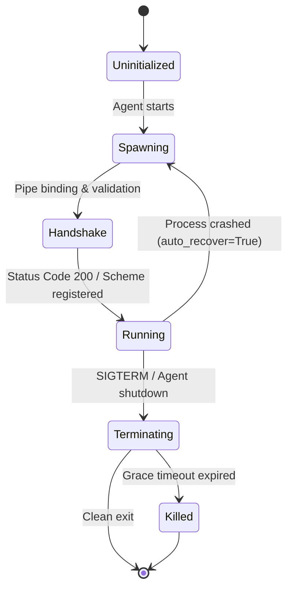
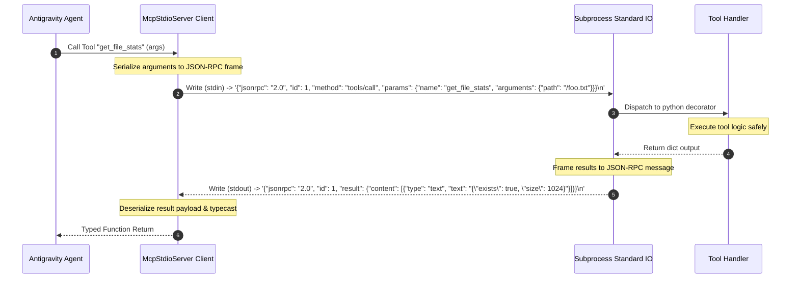

# Antigravity MCP Integration Guide: Part 2 — Tool Registry & Stdio Integration

This technical documentation section outlines the mechanics of tool registration, process isolation, and standard input/output (stdio) integration within the Google Antigravity SDK. Stdio integration serves as the primary mechanism for executing local, high-performance, sandboxed tools by bridging processes via standard stream piping.

---

## 1. Local Process Lifecycle Management

The Google Antigravity SDK provides high-fidelity subprocess management via `types.McpStdioServer`. Unlike basic shells or insecure process execution protocols, the Antigravity SDK handles execution lifecycles in a controlled environment designed to prevent zombie processes, buffer overflows, and memory leaks.

### Subprocess Lifecycle Mechanics
The process lifecycle managed by the SDK is broken down into four distinct phases:
1. **Instantiation & Configuration Resolution**: When an `Agent` starts, it initializes configured `McpStdioServer` instances. It reads environment maps, checks executor policies, and compiles command-line arrays.
2. **Spawning & Pipe Binding**: The SDK spawns the subprocess using platform-optimized async executors (e.g., `asyncio.subprocess` on POSIX systems). Pipes for `stdin` and `stdout` are allocated, while `stderr` is redirected to a separate telemetry monitoring stream to avoid polluting stdout.
3. **Telemetry & Vitality Monitoring**: The SDK actively tracks the process PID and monitors thread states. If a subprocess crashes, the SDK registers a warning, executes safety protocols, and attempts auto-restarting if `auto_recover=True` is enabled.
4. **Graceful Terminating & Resource Release**: When the agent undergoes shutdown (e.g., catching `SIGTERM` or `SIGINT`), the SDK issues a structured shutdown sequence:
   - It sends a JSON-RPC lifecycle notification (`exit` or `shutdown`) to allow clean application teardown.
   - If the process fails to exit within a configured grace period (default `5000ms`), the SDK escalates to `SIGKILL` to clean up resources, preventing orphaned processes.



### Security & Subprocess Sandboxing
The Antigravity SDK implements stringent security gates around stdio server spawning:
- **Directory Restrictions**: Subprocesses are executed within a confined working directory (`cwd`), and path translations are strictly enforced to prevent access to raw system resources.
- **Environment Sanitation**: Default environment variables are cleared. The SDK injects only whitelisted parameters and standard runtime flags to shield host environments.
- **Execution Limits**: The execution context utilizes OS cgroups or task limits to restrict memory usage, thread count, and CPU slices.

### Production-Grade Integration Example
The following snippet demonstrates how to configure, instantiate, and manage a local stdio server using `google.antigravity` core types.

```python
import os
import sys
from google.antigravity import Agent, LocalAgentConfig
from google.antigravity.types import McpStdioServer
from google.antigravity.policy import Policy, allow

class SandboxedUtilityPolicy(Policy):
    """
    Strict security policy enforcing runtime safety and limiting
    allowed executable paths and arguments.
    """
    def authorize_subprocess(self, command: list[str]) -> bool:
        # Validate that we are running verified python interpreters
        allowed_executables = {"python", "python3", sys.executable}
        executable_basename = os.path.basename(command[0])
        if executable_basename not in allowed_executables:
            return False
            
        # Stop shell injection attempts by rejecting script concatenations
        for arg in command:
            if ";" in arg or "&&" in arg or "||" in arg:
                return False
        return True

def initialize_stdio_agent() -> Agent:
    # 1. Instantiate the Stdio Server Configuration
    stdio_server = McpStdioServer(
        name="workspace-diagnostic-server",
        command=[sys.executable, "/Users/khallad/Documents/LocationTaskReminder/LocTaskReminder/scripts/mcp_server.py"],
        args=["--mode", "restricted", "--sandbox-level", "high"],
        env={
            "PATH": "/usr/bin:/usr/local/bin:/bin",
            "PYTHONPATH": "/Users/khallad/Documents/LocationTaskReminder/LocTaskReminder",
            "ANTIGRAVITY_SECURITY_PROFILE": "STRICT",
            "MAX_IO_THREADS": "4"
        },
        cwd="/Users/khallad/Documents/LocationTaskReminder/LocTaskReminder",
        policy=allow.execute_subprocess(SandboxedUtilityPolicy()),
        auto_recover=True,
        max_restarts=3
    )

    # 2. Bind Stdio Server to the Local Agent Configuration
    agent_config = LocalAgentConfig(
        agent_id="location-reminder-architect",
        name="Antigravity Location Architect",
        mcp_servers=[stdio_server],
        enable_telemetry=True,
        telemetry_endpoint="http://localhost:4317" # OpenTelemetry integration
    )

    # 3. Create and Boot the Agent
    agent = Agent(config=agent_config)
    return agent

if __name__ == "__main__":
    agent = initialize_stdio_agent()
    print(f"Agent '{agent.config.name}' booted with isolated stdio server registry.")
```

---

## 2. Under-the-Hood Invocation & Serialization/Deserialization

The Antigravity SDK abstracts stdio streaming interfaces into high-level Python methods. The under-the-hood channel leverages strict structural standard stream plumbing.

### Stdio Communication Protocol
Communication is framed entirely around the **JSON-RPC 2.0 Specification**. Stdio operates as a full-duplex stream:
- **`stdin` (Write channel of agent, read channel of subprocess)**: The agent sends structured requests (e.g. `tools/call`, `tools/list`) and notifications to the tool.
- **`stdout` (Read channel of agent, write channel of subprocess)**: The subprocess outputs response payloads and system notifications.
- **`stderr` (Isolated monitoring channel)**: Any trace, unhandled error, or standard warning is logged strictly here. The parent process processes these lines separately and feeds them into agent trace logs to prevent JSON-RPC parser breakdowns.

### JSON-RPC 2.0 Lifecycle Sequence



### Argument Serialization & Stream Framing
Because stdio channels are character streams, messages are strictly delimited using **line-buffered I/O (newline `\n` framing)**. 
1. **JSON Encoding**: To execute a tool call, target parameters are inspected against standard schema constraints, verified for sanitization, and encoded into an optimized JSON payload string.
2. **Buffer Operations**: The payload is pushed directly to the pipe buffer. A single `\n` is attached at the end, followed by an explicit `flush()` operation on the platform pipe.
3. **Chunked Reader**: On the receiving end, the process reads characters until it hits a newline boundary (`\n`), parses the raw frame into an internal memory buffer, and runs JSON parsing before routing to target tools.

### Stderr Routing and Diagnostics
If a subprocess writes to `stdout` outside the JSON-RPC structural format (e.g., a standard `print("Starting server...")`), the JSON-RPC parsing pipeline of the parent agent will fail. 

The Antigravity SDK handles standard error routing strategically:
- All raw prints inside the tool process must be redirected to `sys.stderr`.
- The parent agent reads `stderr` asynchronously, prefixing each entry with `[mcp-stderr-log][<ServerName>]`.
- If an unhandled traceback emerges on `stderr`, it is captured by `google.antigravity.telemetry` and formatted as a span exception in OpenTelemetry, allowing easy tracing of errors within the process pool.

---

## 3. The FastMCP Bridge

The python-mcp library provides `FastMCP`, which streamlines the creation of highly compliant Model Context Protocol (MCP) servers. The Antigravity SDK leverages FastMCP to extract schema attributes, parameters, and metadata from native Python functions automatically.

### FastMCP Protocol Conversion
`FastMCP` uses type reflection to inspect python function signatures:
- **Type Annotations**: Standard annotations like `int`, `str`, `dict`, and `List` are analyzed and mapped to standard OpenAPI/JSON schema types.
- **Docstrings**: The function's docstring is dynamically parsed. The top paragraph serves as the tool description, and individual parameter docs are mapped to tool property definitions, providing downstream agents with semantic understanding.

### Complete Multi-Tool Server Implementation
The following implementation builds a fully functioning, syntactically valid FastMCP server with custom tools containing strict workspace safety boundaries, cryptographic routines, and error handling.

```python
import os
import math
import hashlib
import sys
from typing import Dict, Any, Optional
from mcp.server.fastmcp import FastMCP

# 1. Initialize FastMCP Server context
mcp = FastMCP(
    name="Location Task Utilities Server",
    description="Isolated utility suite providing mathematical computations, secure hashing, and sandbox file operations."
)

@mcp.tool()
def calculate_factorial(n: int) -> int:
    """
    Computes the mathematical factorial of an integer n.

    Args:
        n: A non-negative integer (0 <= n <= 100).

    Returns:
        The factorial calculation result.
    """
    if n < 0:
        raise ValueError("Factorial calculation is undefined for negative integers.")
    if n > 100:
        raise ValueError("Integer exceeds safety threshold (100) to prevent CPU starvation.")
    return math.factorial(n)

@mcp.tool()
def get_file_stats(path: str) -> Dict[str, Any]:
    """
    Retrieves safe filesystem metadata for a given path within the workspace boundary.

    Args:
        path: The target file path (must reside inside the active project sandbox).

    Returns:
        A dictionary containing existence status, file size, modification times, and access permissions.
    """
    # Enforce standard sandboxing boundaries to prevent directory traversal attacks
    workspace_root = "/Users/khallad/Documents/LocationTaskReminder/LocTaskReminder"
    normalized_path = os.path.abspath(os.path.join(workspace_root, path))

    if not normalized_path.startswith(workspace_root):
        raise PermissionError("Access Denied: Path requested resides outside the workspace boundary.")

    if not os.path.exists(normalized_path):
        return {
            "exists": False,
            "path": path,
            "error": "File does not exist"
        }

    stat_data = os.stat(normalized_path)
    return {
        "exists": True,
        "path": path,
        "size_bytes": stat_data.st_size,
        "is_directory": os.path.isdir(normalized_path),
        "permissions": oct(stat_data.st_mode & 0o777),
        "last_modified": stat_data.st_mtime
    }

@mcp.tool()
def generate_hash(data: str, algorithm: str = "sha256") -> str:
    """
    Generates a secure cryptographic hash signature of the input text block.

    Args:
        data: The raw string data to hash.
        algorithm: The hash algorithm to utilize. Supported options: 'md5', 'sha1', 'sha256', 'sha512'.

    Returns:
        Hexadecimal representation of the generated signature.
    """
    alg_clean = algorithm.lower().strip()
    supported_algorithms = {"md5", "sha1", "sha256", "sha512"}

    if alg_clean not in supported_algorithms:
        raise ValueError(f"Unsupported algorithm '{algorithm}'. Must be one of: {list(supported_algorithms)}")

    hasher = hashlib.new(alg_clean)
    hasher.update(data.encode('utf-8'))
    return hasher.hexdigest()

if __name__ == "__main__":
    # Ensure stdout is buffered line-by-line and prevent unhandled output pollution
    sys.stdout.reconfigure(line_buffering=True)
    
    # Run the FastMCP execution loop
    mcp.run()
```

---

## 4. Identifier Safety & Compatibility

When mapping Python symbols to JSON-RPC tools and parameters, developers must follow naming standards to ensure cross-language compatibility with non-Python executors (e.g., Node.js, C++ engines).

### Identifier Naming Constraints
1. **Characters**: Tool and parameter names must strictly comply with Python identifier rules: they must begin with a letter or underscore, followed exclusively by alphanumeric characters or underscores: `^[a-zA-Z_][a-zA-Z0-9_]*$`.
2. **Length Limit**: The Antigravity SDK enforces a maximum identifier length of **64 characters** to prevent packet inflation and parser overflow.
3. **No Case Mapping Side-Effects**: Do not alternate between standard snake_case and camelCase inside tool declarations. Ensure your variables match parameter declarations exactly as modeled in Python.

### Type Compatibility Mapping

The Antigravity SDK acts as a serialization boundary, mapping Python types to standard JSON-schema definitions.

| Python Type | JSON-Schema Type | SDK Serialization Behavior | Validation Constraint Enforcements |
| :--- | :--- | :--- | :--- |
| `str` | `string` | UTF-8 String serialization. | Minimum length, regex matching, whitespace trim |
| `int` | `integer` | High-precision numeric cast. | Safety boundaries (`-2^53 + 1` to `2^53 - 1`) |
| `float` | `number` | Float serialization, precision-mapped. | Disallows NaN, positive/negative infinity values |
| `bool` | `boolean` | Cast directly to `true` or `false`. | Strict parsing of non-null representation |
| `list` / `List[T]` | `array` | Maps to arrays with structured items. | Enforces type homogeneity dynamically |
| `dict` / `Dict[str, T]` | `object` | JSON structure with mapped key/values. | Key validations, structural properties checks |
| `Optional[T]` | Any `[T, "null"]` | Resolves standard optional arguments. | Defaults to `None` if missing in parameters |

### Complex Types and Pydantic Integration
The Antigravity SDK supports Pydantic models in MCP tool signatures, allowing complex, nested payloads:
- When a Pydantic model class is used as a parameter type in a tool, the SDK generates the complete recursive JSON schema mapping.
- Incoming arguments are validated against the Pydantic schema *prior* to executing the tool function. If validation fails, the SDK handles the exception gracefully, returning a detailed `SchemaMismatchError` structure to the caller via the JSON-RPC interface without crashing the subprocess.

---

## 5. Practical Setup and Troubleshooting

Deploying and maintaining stdio servers within an Antigravity Agent framework requires systematic validation strategies.

### Direct Execution Tests (Manual Verification)
Before registering your stdio server within the agent pipeline, run it as a standalone process and execute manual JSON-RPC verification.

```bash
# Execute your server script directly in your shell environment
python3 /Users/khallad/Documents/LocationTaskReminder/LocTaskReminder/scripts/mcp_server.py
```

Once running, paste a valid JSON-RPC initialization request frame into standard input (stdin) to verify process execution:

```json
{"jsonrpc": "2.0", "id": 1, "method": "tools/list", "params": {}}
```

The process should immediately output the registered schemas to standard output (stdout):

```json
{"jsonrpc": "2.0", "id": 1, "result": {"tools": [{"name": "calculate_factorial", "description": "Computes the mathematical factorial...", "inputSchema": {"type": "object", "properties": {"n": {"type": "integer"}}, "required": ["n"]}}]}}
```

### Diagnostic Tools
For testing pipelines, utilize the native `mcp-cli` diagnostic tool:

```bash
# Debug the stdio process using standard CLI inspection tools
mcp-cli --command "python3" --args "/Users/khallad/Documents/LocationTaskReminder/LocTaskReminder/scripts/mcp_server.py" list-tools
```

---

## Troubleshooting Matrix

The following matrix lists common stdio integration errors, their root causes, and technical remediation steps.

| Diagnostic Code | Primary Error Name | Root Cause Analysis | Remediation Steps |
| :--- | :--- | :--- | :--- |
| `0xEE01` | **`ProcessExitedError`** | Subprocess terminated immediately with a non-zero exit code on startup. Missing python packages or path configuration errors. | 1. Verify file permissions of the script target (`chmod +x`).<br>2. Run `python3 script.py` manually to catch syntax/import failures.<br>3. Check environment path definitions in `McpStdioServer` configuration. |
| `0xEE02` | **`ProtocolDesyncError`** | Raw logs, standard prints, or trace elements were written to `stdout` instead of `stderr`, breaking JSON-RPC parsing. | 1. Audit script codebase and replace all instances of `print()` with `sys.stderr.write()` or standard `logging`.<br>2. Set `sys.stdout.reconfigure(line_buffering=True)` to prevent flushing delays.<br>3. Configure `enable_telemetry` on client configs. |
| `0xEE03` | **`TimeoutError`** | Process did not respond to standard input queries within the expected transaction window (default `30s`). | 1. Inspect execution threads for infinite loops or deep recursive blocking calls.<br>2. Refactor complex calculations into non-blocking async loops.<br>3. Raise timeout thresholds using the configuration property: `timeout_seconds`. |
| `0xEE04` | **`PermissionError`** | Security policies prevented script execution, file modification, or directory traversal operations. | 1. Review and refine your Custom `Policy` subclasses.<br>2. Check local OS permissions and verify standard sandbox paths match workspace roots.<br>3. Enforce normalized path matches (`os.path.abspath`) in code logic. |
| `0xEE05` | **`SchemaMismatchError`** | Server argument types sent from the calling agent do not match the function type signature of the tool. | 1. Ensure type annotations on Python tools match expected JSON representations.<br>2. Validate incoming parameters inside Pydantic structures.<br>3. Reset local tool registry cache directories on the parent Agent. |
