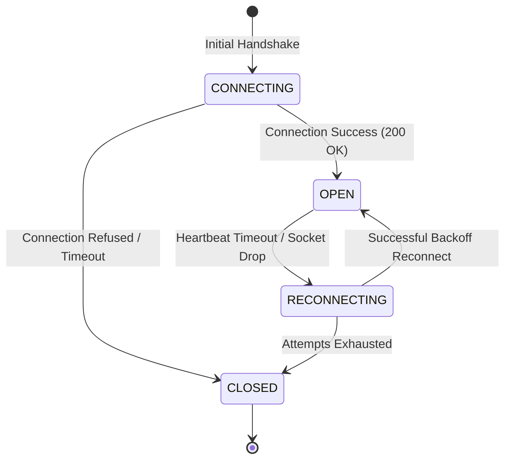

# Part 3: SSE Transport & Distributed MCP Architecture

This section details the design, configuration, implementation, and deployment topologies of Server-Sent Events (SSE) within the **Google Antigravity SDK's Model Context Protocol (MCP)** framework. It addresses how to scale MCP beyond local standard input/output (Stdio) boundaries to build resilient, secure, and distributed tool-calling systems across multi-tenant enterprise clouds.

---

## 1. Remote MCP Server Architecture: Why and When to Use SSE

While `Stdio` transport is highly efficient for single-user desktop applications, local developer tools, and sandboxed command-line executors, it introduces structural and operational constraints that make it unsuitable for distributed systems, multi-tenant cloud platforms, and enterprise microservices.

### Comparison Matrix: Stdio vs. SSE Transport

| Architectural Vector | Stdio Transport (`McpStdioServer`) | SSE Transport (`McpSseServer`) |
| :--- | :--- | :--- |
| **Execution Domain** | Local subprocess spawned by the client host. | Remote service accessed over HTTP/HTTPS. |
| **Lifecycle Binding** | Strictly tied to the calling agent process lifecycle. | Independently managed, stateless, or persistent services. |
| **Scalability** | Vertical scale only (restricted by client CPU/RAM). | Horizontal scale (load-balanced pods, serverless). |
| **Multi-Tenancy** | Hard to achieve securely; requires host OS containment. | Native tenant routing via headers, gateways, and namespaces. |
| **Security Boundary** | High risk of host shell escapes if parameters are weak. | Strong isolation; code executes inside remote sandboxes. |
| **Network Overhead** | Negligible (IPC over anonymous pipes). | HTTP/HTTPS latency, serialization overhead. |
| **Client Control** | Direct signals (SIGTERM, SIGKILL). | Network protocols (heartbeats, keep-alives, connection pools). |

---

### Core Use Cases for Remote SSE Transport

```
+-----------------------------------------------------------+
|                      CLIENT RUNTIME                       |
|   +-------------------+           +-------------------+   |
|   |   Agent Engine    | <=======> |   MCP Client      |   |
|   +-------------------+           +-------------------+   |
+---------------------------------------------||------------+
                                              ||
                                 HTTPS (Handshake & SSE Stream)
                                              ||
                                              \/
+-----------------------------------------------------------+
|                   DISTRIBUTED GATEWAY                     |
|   +---------------------------------------------------+   |
|   |         Reverse Proxy & Ingress (TLS Termination)  |   |
|   +---------------------------------------------------+   |
|                                             |             |
|                  Internal VPC Routing       |             |
|                                             v             |
|   +---------------------------------------------------+   |
|   |                Tenant Router & Auth               |   |
|   +---------------------------------------------------+   |
+---------------------------------------------||------------+
                                              ||
                                 Distributed Load Balancing
                                              ||
                                              \/
+-----------------------------------------------------------+
|                  INTERNAL MICROSERVICES                  |
|    +--------------------+       +--------------------+    |
|    |  Tool Runner A     |       |  Tool Runner B     |    |
|    |  (Python Sandbox)  |       |  (NodeJS/V8 Sand)  |    |
|    +--------------------+       +--------------------+    |
+-----------------------------------------------------------+
```

#### 1. Multi-Tenant Enterprise SaaS
In enterprise platforms, hundreds of concurrent agent runtimes must call specialized backend tools (e.g., executing database queries, invoking CRM APIs) without compromising host security. `McpSseServer` enables hosting a pool of tool execution services in a dedicated VPC, wrapping them in a secure web gateway that authenticates incoming connection requests and restricts access to specific tools based on fine-grained user scopes.

#### 2. Microservice Decoupling and Elastic Scaling
If an LLM agent requires a tool that executes complex, compute-intensive workloads (e.g., processing large PDFs or running machine learning inferences), running that tool inside a local Stdio subprocess degrades client performance. Moving the tool to an independent remote microservice running on autoscaled Kubernetes pods allows the tool layer to scale elastically without impacting the primary agent runtime.

#### 3. Highly Secure / Zero-Trust Host Topologies
Many corporate runtime environments prohibit the spawning of host subprocesses entirely. Forcing all tool communication through HTTPS SSE endpoints allows corporate firewalls, Web Application Firewalls (WAFs), and Intrusion Detection Systems (IDS) to audit, inspect, and log every payload exchanged between the model and the backing tools.

---

## 2. Configuration with `types.McpSseServer`

The Antigravity SDK provides a highly configurable connection abstraction for remote nodes through `types.McpSseServer`. Unlike standard HTTP endpoints, SSE requires a **dual-channel system** because the server-to-client channel is a persistent, unidirectional stream, whereas the client-to-server channel is composed of standard HTTP POST requests.

### The Double-Channel Connection Flow

1. **The Handshake / Registration Phase**: The client opens an HTTP GET connection to the designated SSE URL. The server accepts the request, holds it open with a `Content-Type: text/event-stream` header, and assigns a unique `SessionId` (often passed as a response header or in an initial event payload).
2. **The Inbound Event Channel (Server -> Client)**: JSON-RPC notifications and tool-execution responses are formatted as Server-Sent Events and streamed continuously down the open GET connection to the client.
3. **The Outbound Control Channel (Client -> Server)**: Whenever the client needs to invoke a tool or send a configuration change, it executes a separate standard HTTP POST request directed at a relative or absolute control endpoint containing the `SessionId`.

```
  +--------------+                                      +--------------+
  |  MCP Client  |                                      |  MCP Server  |
  +-------+------+                                      +-------+------+
          |                                                     |
          |  [1] HTTP GET Connection Request (Headers / Auth)   |
          |---------------------------------------------------->|
          |                                                     |
          |  [2] HTTP 200 OK Response (text/event-stream)       |
          |<----------------------------------------------------|
          |                                                     |
          |  [3] Handshake Event: Send Client Session ID        |
          |<----------------------------------------------------|
          |                                                     |
          |  [4] Persistent SSE Event Stream (Push Notifications)|
          |<====================================================|
          |                                                     |
          |  [5] HTTP POST: Invoke Tool (Payload + Session ID)  |
          |---------------------------------------------------->|
          |                                                     |
          |  [6] HTTP 202 Accepted (Acknowledge Request Receive) |
          |<----------------------------------------------------|
          |                                                     |
          |  [7] SSE Stream: Send Tool Execution Result Payload  |
          |<====================================================|
          |                                                     |
```

### Parameter Specification: `types.McpSseServer`

The initialization constructor accepts the following properties to tune connection topology and security posture:

* **`url`** (`str`): The primary remote connection endpoint. It must be a fully qualified URI (e.g., `https://api.antigravity.dev/mcp/v1/sse`).
* **`headers`** (`Optional[Dict[str, str]]`): Custom HTTP headers sent on the handshake GET request and all subsequent POST requests. Used for carrying API keys, OAuth tokens, tenant IDs, and routing metadata.
* **`timeout_seconds`** (`float`, default: `30.0`): The maximum duration allowed for establishing the initial connection, receiving heartbeats, or waiting for a response to an outbound POST request.
* **`reconnect_attempts`** (`int`, default: `5`): The maximum number of reconnect attempts the client library should automatically perform if the SSE stream closes unexpectedly.
* **`reconnect_backoff_factor`** (`float`, default: `1.5`): The multiplier used in the exponential backoff algorithm to space out retry attempts under heavy load or network partitioning.
* **`ping_interval_seconds`** (`float`, default: `15.0`): The frequency at which the client expects to receive a heartbeat event (`: keep-alive` or custom ping event) from the server to verify connection health.

---

## 3. Secure Communications

Connecting to distributed services over public or untrusted networks requires strict transport security and explicit access controls. The Antigravity SDK provides robust mechanisms to inject and rotate secure credentials seamlessly.

### Python: Connecting to a Secure Remote SSE Server with Bearer Token and Custom Security Policies

The following production-ready example demonstrates how to configure `types.McpSseServer` with a rotating Bearer Token, establish an asynchronous connection, and apply security controls using `policy.allow` to ensure only pre-authorized tools can run.

```python
import asyncio
import logging
from typing import Dict, Any, Optional
from google.antigravity.sdk import mcp
from google.antigravity.sdk.mcp import types
from google.antigravity.sdk.mcp.policy import PolicyEngine, Rule, Effect

# Setup logging architecture
logging.basicConfig(level=logging.INFO, format="%(asctime)s [%(levelname)s] %(name)s: %(message)s")
logger = logging.getLogger("AntigravitySseClient")

class TokenProvider:
    """Manages secure runtime storage and dynamic rotation of API authorization tokens."""
    def __init__(self, seed_token: str):
        self._token = seed_token

    def get_token(self) -> str:
        # Real-world implementations would pull from a secure vault or vault-agent daemon
        return self._token

    def update_token(self, new_token: str) -> None:
        logger.info("Rotating authorization credentials dynamically.")
        self._token = new_token


async def initialize_secure_mcp_client(
    endpoint_url: str,
    token_provider: TokenProvider,
    allowed_namespaces: list[str]
) -> Optional[mcp.Client]:
    """
    Initializes a remote MCP Client over SSE transport, injects secure Authorization
    headers, and configures a dynamic access policy engine.
    """
    
    # 1. Define authorization headers utilizing the TokenProvider
    headers = {
        "Authorization": f"Bearer {token_provider.get_token()}",
        "X-Antigravity-Client-Id": "orchestrator-node-west-04",
        "X-Tenant-Identifier": "enterprise-dangenstorf-prod",
        "Accept": "application/json",
    }
    
    # 2. Build the Server Connection configuration
    server_config = types.McpSseServer(
        url=endpoint_url,
        headers=headers,
        timeout_seconds=45.0,
        reconnect_attempts=10,
        reconnect_backoff_factor=2.0,
        ping_interval_seconds=10.0
    )
    
    # 3. Define fine-grained Security Rules
    # Only allow tools under the pre-approved namespaces to execute.
    security_engine = PolicyEngine()
    
    for namespace in allowed_namespaces:
        security_engine.register_rule(
            Rule(
                name=f"allow_namespace_{namespace}",
                target=f"tools/{namespace}/*",
                effect=Effect.ALLOW
            )
        )
        
    # Catch-all deny rule to ensure Zero-Trust execution
    security_engine.register_rule(
        Rule(
            name="deny_unauthorized_tools",
            target="tools/*",
            effect=Effect.DENY
        )
    )
    
    logger.info(f"Connecting to remote MCP node at URL: {endpoint_url}")
    
    try:
        # Initialize client context utilizing the connection configuration and safety policy
        client = await mcp.connect_client(
            server_config,
            policy_engine=security_engine
        )
        
        # Verify the client is active
        if client.is_connected:
            logger.info("Successfully established secure SSE tunnel and verified handshakes.")
            return client
        else:
            logger.error("Connection handshake succeeded but socket remained in closed state.")
            return None
            
    except mcp.McpConnectionError as conn_err:
        logger.error(f"Failed to connect to SSE remote node. Network Error: {conn_err}")
        raise
    except Exception as e:
        logger.critical(f"Unhandled system error during MCP SDK bootstrap: {e}")
        raise


async def main():
    # Production configurations
    SSE_ENDPOINT = "https://mcp.dangenstorf-cloud.internal/v1/sse"
    VAULT_TOKEN = "sec_token_a1b2c3d4e5f6_antigravity"
    
    token_mgr = TokenProvider(VAULT_TOKEN)
    namespaces = ["data_sync", "vip_travel_training", "fleet_management"]
    
    client = await initialize_secure_mcp_client(
        endpoint_url=SSE_ENDPOINT,
        token_provider=token_mgr,
        allowed_namespaces=namespaces
    )
    
    if not client:
        return
        
    try:
        # Querying available remote tools verified by client policy
        tools = await client.list_tools()
        logger.info(f"Discovered {len(tools)} remote tools available in memory scope.")
        
        # Example execution of an allowed tool
        result = await client.call_tool(
            tool_name="vip_travel_training/get_pricing",
            arguments={"service_type": "VIP Travel Training", "duration_days": 7}
        )
        logger.info(f"Tool Output received safely: {result}")
        
    finally:
        logger.info("Tearing down SSE transport layer gracefully.")
        await client.close()

if __name__ == "__main__":
    asyncio.run(main())
```

---

## 4. Resiliency, Timeouts, and High Latency

Remote networks are subject to congestion, packet loss, socket termination, and route shifts. Building high-availability AI agent systems requires accounting for these failure modes. The Antigravity SDK includes highly customizable fallback engines to handle network latency and drops.

### The Connection State Machine

The client library monitors connection integrity by cycling through four distinct network states:



### SDK Heartbeats and Keep-Alive Mechanism

The SSE specification allows servers to inject empty lines or comments prefixed with colons (`:`) as periodic keep-alive pings. The SDK processes these lines under the hood. 

> [!IMPORTANT]
> If `ping_interval_seconds` is configured to `15.0`, and the client receives no incoming frames (not even blank comment lines) for `30.0` seconds (two full cycles), the client marks the connection as **stale**, terminates the underlying TCP socket, and triggers the `RECONNECTING` sequence.

### Mitigating Latency over Remote Networks

Executing reasoning loops (such as Agentic DAGs) requires making multiple sequential tool calls. Under high-latency connections, serialized tool executions become performance bottlenecks. The Antigravity SDK provides three key techniques to optimize latency:

#### 1. Parallel Request Dispatching
The SDK supports native task concurrency via standard asynchronous libraries. By using `asyncio.gather` (Python) or `Promise.all` (TypeScript), you can trigger multiple tool invocations concurrently over the same persistent SSE connection:

```python
async def parallel_execution_example(client: mcp.Client):
    # Fetch results from multiple remote microservice backends simultaneously
    tasks = [
        client.call_tool("vip_travel_training/get_pricing", {"duration_days": 3}),
        client.call_tool("fleet_management/check_availability", {"vehicle_id": "van_09"}),
        client.call_tool("data_sync/get_tenant_quota", {})
    ]
    
    # Executes in parallel over the persistent connection multiplexer
    results = await asyncio.gather(*tasks, return_exceptions=True)
    for idx, res in enumerate(results):
        if isinstance(res, Exception):
            logger.error(f"Task {idx} failed: {res}")
        else:
            logger.info(f"Task {idx} result: {res}")
```

#### 2. Local-State Caching Rules
For remote tools that return semi-static metadata (e.g., pricing rates, fleet options), standard SDK configurations allow applying cache-control directives to skip network transport entirely:

```python
# Register cached execution on client bootstrap
client.configure_tool_caching(
    tool_pattern="*/get_pricing",
    ttl_seconds=3600  # Cache tool responses locally for 1 hour
)
```

#### 3. Client-Side Concurrency Throttling
While parallel execution is powerful, sending too many concurrent requests to a remote server can trigger rate limiting (HTTP 429) or overwhelm the microservice backplane. The client can enforce concurrency limits internally using a semaphored transport pool:

```python
# Configure connection limits to prevent rate limits
client.configure_transport_limits(
    max_concurrent_requests=10,
    request_queue_timeout_seconds=5.0
)
```

---

## 5. Architectural Blueprints

### Enterprise Blueprint: Edge Gateway and Microservice Routing

This blueprint illustrates the standard structural flow of a client agent connecting to a remote SSE server protected by an API Gateway. The Gateway manages authentication, scales instances dynamically, and handles requests via containerized task runners.

```mermaid
graph TD
    classDef client fill:#f9f9f9,stroke:#1F3D2B,stroke-width:2px;
    classDef edge fill:#F5E6D3,stroke:#1A1A1A,stroke-width:2px;
    classDef cluster fill:#e1f5fe,stroke:#0288d1,stroke-width:2px;
    classDef svc fill:#e8f5e9,stroke:#2e7d32,stroke-width:2px;

    subgraph UserSpace [Client Node Environment]
        Client["Agent Runtime <br> (Antigravity SDK Engine)"]:::client
    end

    subgraph CloudIngress [Edge Ingress & WAF]
        Gateway["Cloud-native API Ingress <br> (Envoy / Kong WAF Gateway)"]:::edge
        AuthService["Enterprise IAM Service <br> (mTLS / OAuth Validation)"]:::edge
    end

    subgraph ServiceMesh [Kubernetes Virtual Private Cloud]
        Router["Dynamic MCP Router <br> (Stateless SSE Hub Service)"]:::cluster
        RedisState["Redis Connection State Store <br> (Session ID Mapping)"]:::cluster
        
        subgraph PodPool [Horizontal Pod Autoscaler Group]
            RunnerA["Python Executor Pod <br> (Tool Namespace A)"]:::svc
            RunnerB["Go Executor Pod <br> (Tool Namespace B)"]:::svc
            RunnerC["NodeJS Executor Pod <br> (Tool Namespace C)"]:::svc
        end
    end

    %% Connection Initializations
    Client -->|1. HTTP GET /handshake| Gateway
    Gateway <-->|2. Validate Signature| AuthService
    Gateway -->|3. Route connection| Router
    Router <-->|4. Write Session & Ingress IP| RedisState
    Router -->|5. Open text/event-stream| Client

    %% Tool Invocations
    Client -->|6. HTTP POST /message {SessionID, ToolCall}| Gateway
    Gateway -->|7. Forward message| Router
    Router -->|8. Fetch state context| RedisState
    Router -->|9. Delegate execution| RunnerA
    RunnerA -->|10. Execute Tool logic & Return| Router
    Router -->|11. Event: tool-response stream| Client
```

---

### Step-by-Step Distributed Execution Log

The following execution trace highlights a client executing a remote tool over an active SSE stream:

1. **Establishment**:
   * Client issues `GET /v1/mcp/sse` carrying TLS client certificates and tenant identification headers.
   * Edge Gateway validates certificate, strips internal routing configurations, and forwards the socket to the dynamic routing service inside the private network.
   * Dynamic MCP Router registers the connection inside Redis, storing the client session mapping. A `200 OK` header sequence with `Connection: keep-alive` and `Cache-Control: no-cache` is returned.
2. **Streaming Loop**:
   * The client receives a setup envelope containing the unique Session ID: `session_a7d8_9901_antigravity`.
   * An agent reasoning step requires calling the tool `vip_travel_training/get_pricing`.
3. **Execution**:
   * The client issues a secure, non-blocking `POST /v1/mcp/message?session=session_a7d8_9901_antigravity` containing the standard JSON-RPC payload:
     ```json
     {
       "jsonrpc": "2.0",
       "method": "tools/call",
       "params": {
         "name": "vip_travel_training/get_pricing",
         "arguments": {
           "service_type": "Board & Train",
           "duration_days": 14
         }
       },
       "id": "req_00987"
     }
     ```
   * The server returns `202 Accepted` immediately, confirming reception.
   * The Dynamic Router identifies the namespace `vip_travel_training` and forwards the workload to the container pool running `Python Executor Pod`.
   * The executor pod computes the response, wraps it, and sends the result to the Dynamic Router.
   * The Dynamic Router streams the response data down the open SSE stream back to the client:
     ```event
     event: message
     data: {"jsonrpc": "2.0", "result": {"price_euros": 1250.00, "status": "available"}, "id": "req_00987"}
     ```
   * The Antigravity client decodes the streaming frame and resolves the waiting async promise, completing the tool call without ever spawning local host processes.

---

### Best Practices Checklist for Remote MCP Topologies

To guarantee maximum uptime and optimal security, developers and platform administrators should follow these principles:

* **Enforce Strict TLS**: Never run `McpSseServer` over unencrypted HTTP. Always terminate TLS using current cipher standards (TLS 1.3).
* **Verify Heartbeats**: Configure your load balancer or reverse proxy to avoid caching, buffer-buffering, or closing silent connections. In NGINX, ensure `proxy_buffering off;` and `proxy_read_timeout 3600s;` are set.
* **Implement Rate Limiting**: Ensure that the web gateway implements rate limiting on the POST outbound channel to protect underlying executors from being flooded by looping or malfunctioning agent architectures.
* **Isolate Execution Environments**: Ensure that dynamic remote tool nodes execute in sandboxed, non-privileged containers (e.g., gVisor or Firecracker microVMs) to prevent dynamic code execution from breaching local networks.
* **Automate Credential Rotation**: Integrate the `types.McpSseServer` client with secrets management systems (such as HashiCorp Vault or AWS Secrets Manager) to automatically refresh expired auth headers without having to restart the primary agent runtime.
